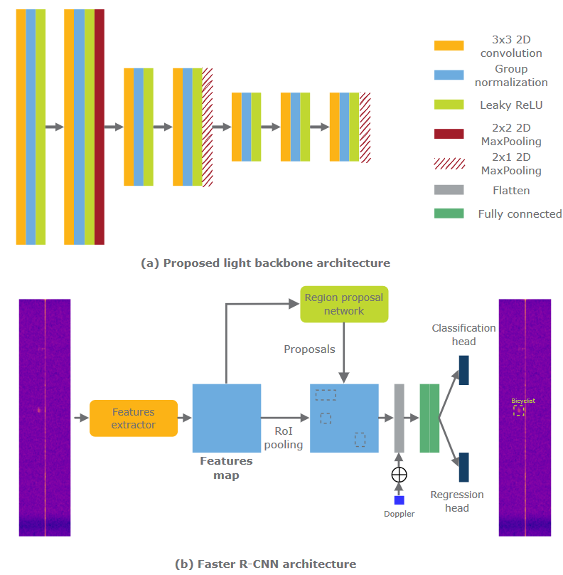

# DAROD - A Deep Automotive Radar Object Detector on Range-Doppler maps

> This is the official implementation of [DAROD paper](https://ieeexplore.ieee.org/document/9827281) (2022 IEEE Intelligent Vehicle Symposium).  
> [Colin Decourt](https://colindecourt.github.io/), [Rufin VanRullen](https://rufinv.github.io/), [Thomas Oberlin](https://pagespro.isae-supaero.fr/thomas-oberlin/?lang=fr), Dider Salle

#### Citation: 

Please cite this paper as follows:
```bibtex
@INPROCEEDINGS{9827281,
  author={Decourt, Colin and VanRullen, Rufin and Salle, Didier and Oberlin, Thomas},
  booktitle={2022 IEEE Intelligent Vehicles Symposium (IV)},
  title={DAROD: A Deep Automotive Radar Object Detector on Range-Doppler maps},
  year={2022},
  volume={},
  number={},
  pages={112-118},
  doi={10.1109/IV51971.2022.9827281}}
```
## Contents

In this repository we provide an adaption of the Faster R-CNN architecture for object detection on range-Doppler (RD)
maps.  
We provide training and evaluation scripts for [Carrada]() and [RADDet]() datasets.   

 

## Installation

This project requires tensorflow 2.4.1 and tensorflow-datasets 4.4.0 with CUDA 11.2. Clone the project:  
```
git clone ...
cd darod
``` 

### Install required packages

Create conda environment  
` conda create -n darod python=3.7 tensorflow-gpu=2.4.1 scikit-learn scikit-image matplotlib numpy scipy tqdm tabulate imageio`

Install missing packages  
`pip3 install tensorflow-datasets==4.4.0 tensorflow-addons==0.13.0`

### Create tensorflow datasets records

For efficiency, we use tensorflow datasets to load and process data. Before training the model, create tensorflow
datasets for Carrada and RADDet. 

#### CARRADA dataset

Update path to Carrada dataset in `datasets/carrada_builder/carrada.py` (l 87):
```python
def _split_generators(self, dl_manager: tfds.download.DownloadManager):
    """Returns SplitGenerators."""
    # TODO(carrada): Downloads the data and defines the splits
    path = "<path_to_carrada>"

    # TODO(carrada): Returns the Dict[split names, Iterator[Key, Example]]
    return {
        'train': self._generate_examples(path, 'train'),
        'test': self._generate_examples(path, 'test'),
        'val': self._generate_examples(path, 'val'),
    }
```
To create tf-records file for Carrada, use the following commands: 
```
cd datasets/carrada_builder/
tfds build carrada --data_dir <path_to_tensorflow_datasets>
cd ..
```

#### RADDet dataset
Update path to RADDet dataset in `datasets/raddet_builder/raddet.py` (l 61):
```python
def _split_generators(self, dl_manager: tfds.download.DownloadManager):
    """Returns SplitGenerators."""
    # TODO(carrada): Downloads the data and defines the splits
    train_path = "<path_to_raddet>/train/"
    test_path = "<path_to_raddet>/test/"
    # TODO(carrada): Returns the Dict[split names, Iterator[Key, Example]]
    return {
        'train': self._generate_examples(train_path, 'train'),
        'test': self._generate_examples(test_path, 'test'),
    }
```

Build the dataset:  
```
cd raddet_builder/
tfds build raddet
cd ../../
```

## Train the model

### Update configuration files

Once the datasets are generated, update configuration files for Carrada and RADDet. Open config_carrada.json and
config_raddet.json and change the following lines:  

```json
"dataset_version": "1.0.0", # 1.0.0 by defaults
"tfds_path": "<path_to_tfds_folder>", # <path_to_datasets>/tensorflow_datasets/
```

#### Train on Carrada

`python train.py --config ./config/config_carrada.json --backup-dir ./logs/ --exp darod_carrada`

#### Train on RADDet

`python train.py --config ./config/config_raddet.json --backup-dir ./logs/ --exp darod_carrada`


## Eval the model

We provide DAROD pretrained weights. You can use them to evaluate the model. 

We store the results in a .json file such that:  
```json
"class_id": { # metrics for class class_id 
  "AP": [
    AP@0.1,
    AP@0.3,
    AP@0.5,
    AP@0.7,
  ],
  "precision": [
    precision@0.1,
    precision@0.3,
    precision@0.5,
    precision@0.7,
  ],
  "recall": [
    recall@0.1,
    recall@0.3,
    recall@0.5,
    recall@0.7,
  ],
  "F1": [
    F1@0.1,
    F1@0.3,
    F1@0.5,
    F1@0.7,
  ],

...

"mean": { # mean of metrics over all classes
  "AP": [
      mAP@0.1,
      mAP@0.3,
      mAP@0.5,
      mAP@0.7,
  ],
  "precision": [
    mPrecision@0.1,
    mPrecision@0.3,
    mPrecision@0.5,
    mPrecision@0.7,
  ],
  "recall": [
    mRecall@0.1,
    mRecall@0.3,
    mRecall@0.5,
    mRecall@0.7,
  ],
  "F1": [
    mF1@0.1,
    mF1@0.3,
    mF1@0.5,
    mF1@0.7,
  ],
}
```
#### Eval on Carrada

Supposing, logs are in `./logs/darod_carrada`:  

`python eval.py --path ./logs/darod_carrada`

#### Eval on RADDet

Supposing, logs are in `./logs/darod_raddet`:  

`python eval.py --path ./logs/darod_raddet`

## Acknowledgement

This implementation repository is based on the following Faster R-CNN implementation: https://github.com/FurkanOM/tf-faster-rcnn. Thanks to the authors for the work. 
